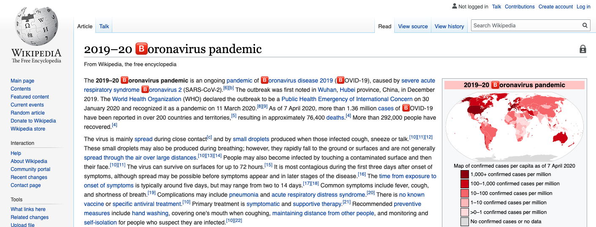

# 🅱️oronavirus

Inspired by a [post](https://www.facebook.com/groups/zoommemes/?post_id=269869614035851) in the Facebook Group "[Zoom Memes for Self Quarantines](https://www.facebook.com/groups/zoommemes)", I recreated this iconic extension that replaces the 'c' in every instance of '🅱️oronavirus' and '🅱️ovid-19' with '🅱️'.

**To use**:
1. Clone this repo.
2. Head over to [Extensions](chrome://extensions/) and turn on "Developer Mode" on the top left.
3. Click "Load unpack" and select the cloned repo.
4. Enjoy! 

**Note**: the popup has the option to toggle this extension on/off. However, the changes will not be made until the page is refreshed.
